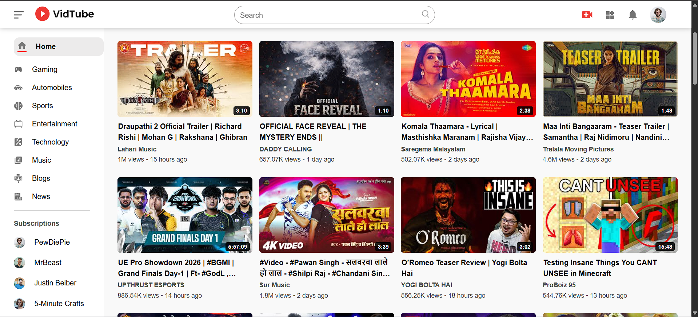
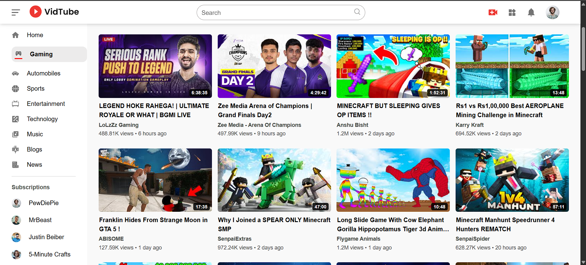
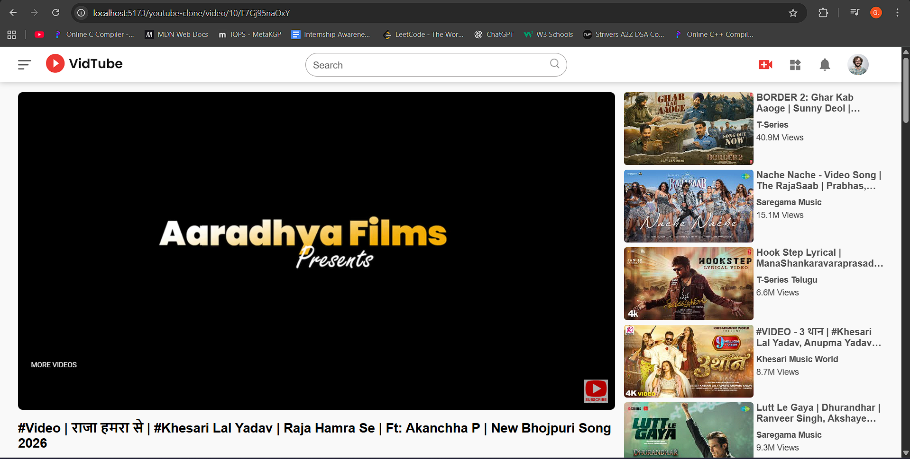

# YouTube Clone 🎥

A feature-rich frontend YouTube clone built using React and the YouTube Data API.

## Features
- Home feed with trending videos
- Collapsible sidebar with category navigation
- Video playback page with related videos
- Search functionality with dynamic results
- In-video navigation to other videos
- Comment section and channel details
- Responsive layout

## Screenshots

### Home Page


### Sidebar & Categories


### Video Player


### Search Results


## Tech Stack
- React
- Vite
- React Router
- YouTube Data API v3

## API Key & Running Locally

This project uses the YouTube Data API v3.

For security reasons, the API key used in this repository is restricted
to specific domains (localhost for the author and the live demo domain).
If you fork or clone this repository, API requests may not work by default.

To run this project fully on your own machine:

1. Create your own YouTube Data API v3 key from Google Cloud Console.
2. Replace the existing API key in the code with your own key.
3. Update the API key restrictions to allow your localhost (e.g., http://localhost:5173).
4. Install dependencies and start the development server:
   ```bash
   npm install
   npm run dev


